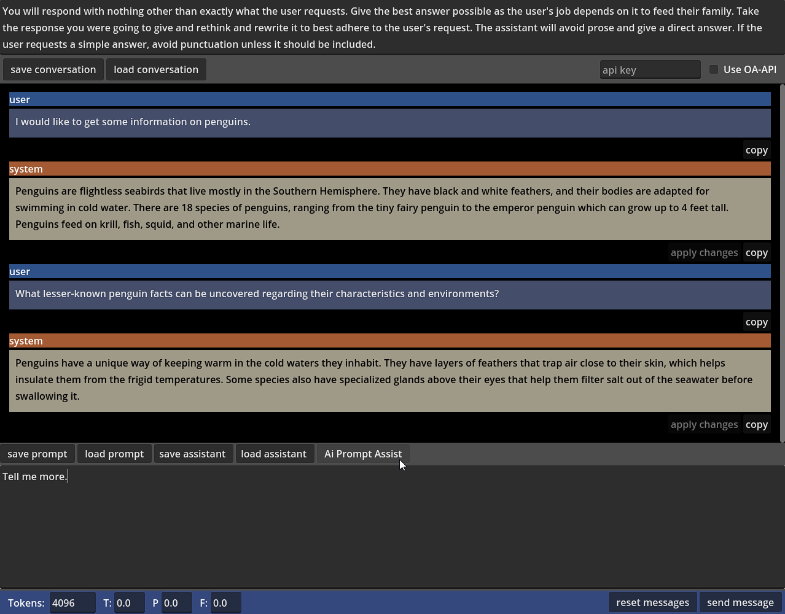

# Simple Godot Chat Application with Local LLM and OpenAI Integration

## Description

This is a simple chat application built for Godot 4+ that uses the LLM API to send and receive messages from an OpenAI compatible API. It's designed to make it easy to use either LM Studio or OpenAI API. The application currently does not save any data, so every time you launch the app you have to give it a key to use OpenAI. The key is not saved and is only used for the current session. Current model from openai the program uses is: gpt-3.5-turbo-16k

## Categories

AI, Chat, OpenAI, LLM, Godot, Godot 4, API, Local LLM, ChatGPT, Chatbot, Assistant, Conversational AI, GDScript

## Features

- Works with LM Studio for local testing and OpenAI when desired. Can force other models for OpenAi.
- The assistant can be changed as desired and you can easily toggle between local and OpenAI.
- Conversations can be reset using the GUI button. Conversations are not saved either.
- f and p penalties are -1 to 1. 0 is default.
- temperature is 0 to 1. 0.5 is default.
- max tokens can really be increased on quite a few models, but 2000 is default.
- conversations show last response at top of the output viewport to oldest response scrolling off.
- assistant prompt can be saved/loaded individually
- save/load conversation will save all but the current prompt area
- save/load prompt will save the users current prompt area.
- file dialogs to handle the saving and loading.
- you can now update the assistant's replies in the conversation window
- chat messages alternate colors for ease of visibility
- flexible/responsive viewport accomodates many resolutions and aspect ratios, keeping the content fresh
- set api key and click checkbox to use remote openai api on your next request
- cool: added a new Ai LLM prompt rewriting assistant to help you craft your prompts. Will respect openai setting and max tokens. (check in res://Button_ai_prompt_assist.gd for more details). Basically just type something in the prompt window and your selected ai choice will regenerate the prompt and attempt to improve it when you click the [ Ai Prompt Assist ] button. Be aware if using openai standard usage rates apply.
- added delete button to each conversation row
- end first release (0.01a - was labelled in code 0.1a but whatever)
- now v0.2a after binary release. That should clear up the weird version issue.
- ai prompt assist button now disables on click until response received.
- empty assistant was causing issues so now set a default in ButtonTest2.gd -> llm_get_messages(): You are an AI assistant.
- selected text ai assistant via context menu in prompt now works. Just select the text and right click mouse button and select "Ai Assist:Selection Clean" to try out
-- see TextEdit_LLM_INPUT script to modify the prompt. I know its ugly but it works kinda okish.
- added translate to chinese, translate to english ai assistants for the prompt area in the prompt text area. Left click to view the context menu to access these new assistants.
- cleaned up the ai assistant code to make it easier to add more assistants (TextEdit_LLM_INPUT)
- I figure the language translation function would help access the powers of foreign language models by allowing ai to help us translate to the natural language of those llms.
- also prompt assist button makes prompt writing a little quicker and easier
- now have ai assistants when editing system responses in chat. Just select text and right click for context menu to use the assistants to help translate or cleanup.
- added ai agent to assistant response context menu: simplify (tries to reduce selected text down to a more compact version to help reduce context window)
- added ai agent to assistant response context menu: expand (does the opposite of simplify)
- increased ai agents max token size window to 16000 tokens to allow for more intelligent agent requests. Be aware of any api costs when using these functions.
- added ai agent to assistant response context menu: generic code improver (weak attempt to improve selected code)
- now stripping triple backticks out of responses from ai agents in assistant responses to normalize and better process returned data
- added ai agent to assistant response context menu: generic code summarizer (replace selected code with a summary of what the code does in the order that it does it)
*  March 24, 2024 
- added ability for agents to read a certain amount of characters ahead and behind (gave them pre and post memory to make the agent's more "intelligent") to send to the assistant's assistant prompt to help process the regular assistant's prompt
- added ai agent to assistant response context menu: intelligent code optimizer (reads the text before the selection (500 chars), reads the text after the selection (500 chars), uses that data to inform assistant and then processes the prompt with the selected data and returns the selected data modified to improve the code)
- these new ai agents with memory will respect the value "Tokens:" in the main gui (same max token return value used in sending messages will be used for the memory powered agents)
- on that last agent, ability to set a different prompt when sending to openai added
- <https://twitter.com/g023dev/status/1771795915117891775> for a demo of intelligent code optimizer
* March 24, 2024
- added ability to change intelligent ai agents' pre/post memory amounts (the amount of characters they can read before and after selection)
- last minute tweaks to export before exporting for 0.2.0 linux/win64 releases
* note: make sure your LLM server is up and running before trying to send requests local

## Usage

- Launch a local openai compatible LLM server (such as LM Studio) if you do not intent to use openai, or if you want to use along side openai
- Run the project.godot file in your Godot editor window (works with 4.2 at the moment) or one of the distribution binaries (Windows or Linux)

## Possible Use Cases

- Ideas to integrate ai api into games programmed in Godot 4 GDScript
- Roll your own Ai assisted text editors
- add ai functionality to your Godot 4+ applications
- * fill in your own ideas here *

## License

This project is licensed under the BSD-3-Clause License - see the [LICENSE](LICENSE) file for details.

## Author

This project was created by [g023](https://github.com/g023).

## Version

0.2a

## Note

Be aware of costs when using the OpenAI API.