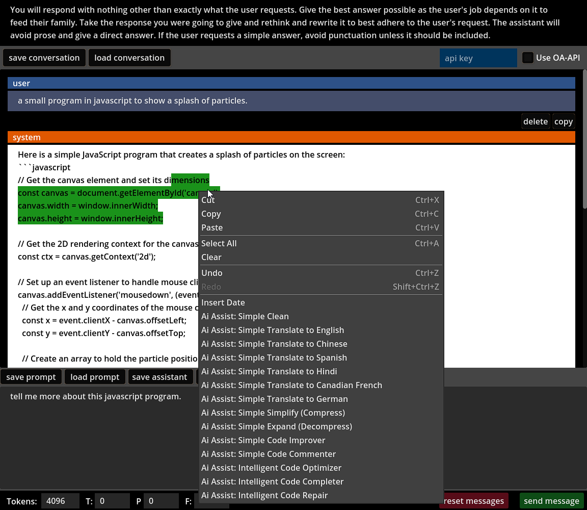

# Simple Godot Chat Application with Local LLM and OpenAI Integration

## Description

This is a simple chat application built for Godot 4+ that uses the LLM API to send and receive messages from an OpenAI compatible API. It's designed to make it easy to use either LM Studio or OpenAI API. The application currently does not save any data, so every time you launch the app you have to give it a key to use OpenAI. The key is not saved and is only used for the current session.

## Categories

AI, Chat, OpenAI, LLM, Godot, Godot 4, API, Local LLM, ChatGPT, Chatbot, Assistant, Conversational AI, GDScript

## Features

- Works with LM Studio for local testing and OpenAI when desired. Can force other models for OpenAi.
- The assistant can be changed as desired and you can easily toggle between local and OpenAI.
- Conversations can be reset using the GUI button. Conversations are not saved either.
- f and p penalties are -1 to 1. 0 is default.
- temperature is 0 to 1. 0.5 is default.
- max tokens can really be increased on quite a few models, but 2000 is default.
- conversations show last response at top of the output viewport to oldest response scrolling off.

## Usage

Scroll down below to the # test area in ButtonTest2.gd to see how to use the functions in a scene. 

## License

This project is licensed under the BSD-3-Clause License - see the [LICENSE](LICENSE) file for details.

## Author

This project was created by [g023](https://github.com/g023).

## Version

0.1a

## Note

Be aware of costs when using the OpenAI API.